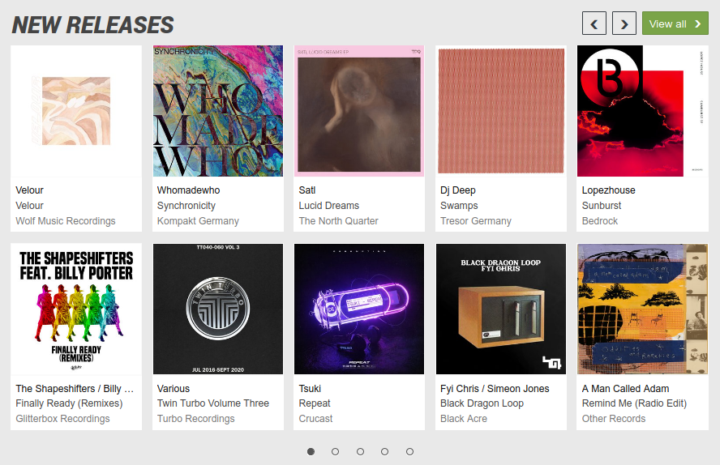
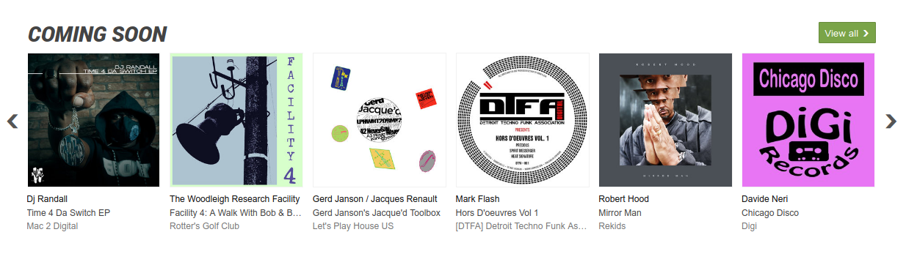

# junodownload scrapper

<div align="center">
  	
</div>

## :information_source: About

With this scrapper you can get the new and coming soon releases `information` from junodownload website. Like the folowing

- Artist
- Album name
- Label
- Cover

<div align="center">
    
  	
</div>

## :package: Built with

- [cheerio](https://www.npmjs.com/package/cheerio)
- [fetch](https://nodejs.org/dist/latest-v18.x/docs/api/globals.html#fetch)

## :pushpin: Setup

**:computer: System requirements**

- [Node.js](https://nodejs.org/en/download/current/) >=18
- MacOS, Windows (including WSL), and Linux are supported
- [pnpm](https://pnpm.io/)

**:arrows_counterclockwise: Clone repository**

```
git clone git@github.com:falsepopsky/junodownload-scrapper.git
```

**:checkered_flag: Install and start the scrapper**

```
pnpm install
```

```
pnpm build
```

```
pnpm start
```

#### :open_file_folder: Folder Structure

<div>

    .
    ├── docs                    # Documentation files
    ├── src                     # Source files
    └── README.md

</div>
