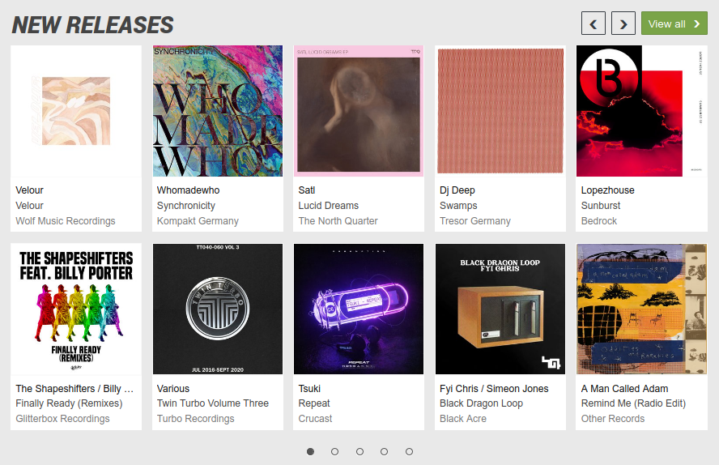
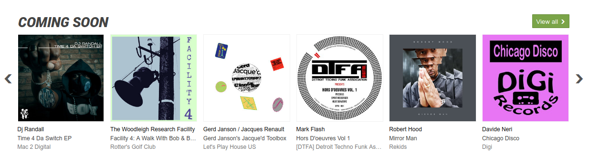

# junodownload scrapper

<div align="center">
  	
</div>

## :information_source: About

This scraper allows you to retrieve information on `new` and `coming soon` releases from the
junodownload website.

<details><summary>Release targets:</summary>
  <div align="center">
    
    
  </div>
</details>

## :sparkles: Features

- Built with TypeScript for full typing support
- Uses the native `fetch` module from Node.js for making HTTP requests
- ESM only

| Information   | New Releases       | Coming Soon        |
| ------------- | ------------------ | ------------------ |
| Artist        | :heavy_check_mark: | :heavy_check_mark: |
| Album (title) | :heavy_check_mark: | :heavy_check_mark: |
| Label         | :heavy_check_mark: | :heavy_check_mark: |
| Cover (url)   | :heavy_check_mark: | :heavy_check_mark: |

## :beginner: Usage

```javascript
import { junoScrapper } from './dist/index.js';

async function start() {
  try {
    const releases = await junoScrapper();
    console.log(releases.get('New releases'));
    console.log(releases.get('Coming soon'));
  } catch (err) {
    console.log(err);
  }
}

start().catch((err) => console.log(err));
```

## :page_facing_up: Docs

- [For developers](https://github.com/falsepopsky/junodownload-scrapper/blob/main/docs/setup.md)

## :scroll: License

`junodownload-scrapper` is licensed under the
[MIT](https://github.com/falsepopsky/junodownload-scrapper/blob/main/LICENSE.md) license - © 2020
[falsepopsky](https://github.com/falsepopsky).
